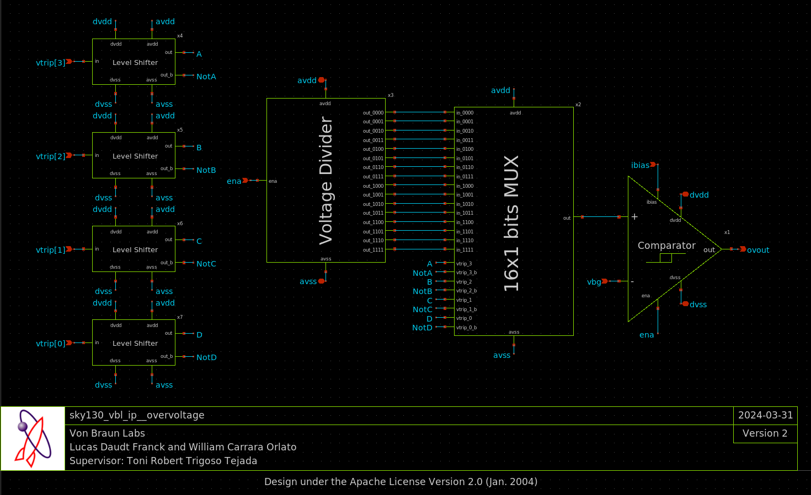
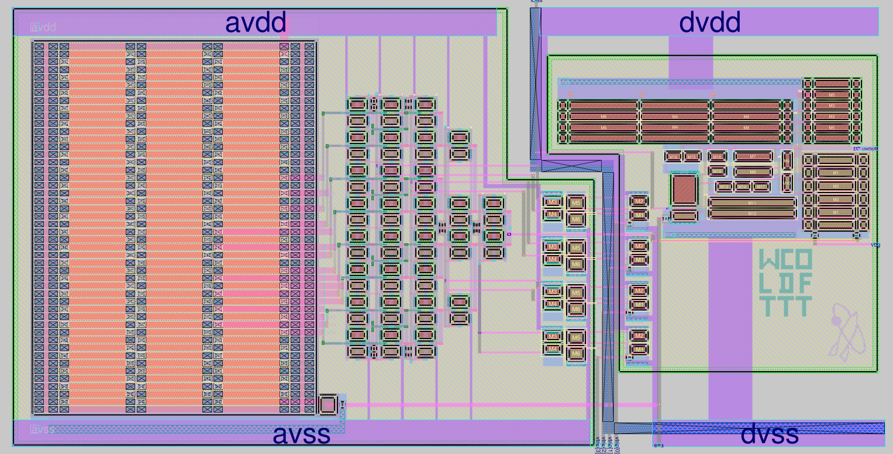
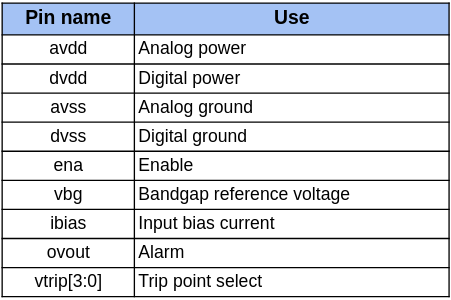

# SKY130 Overvoltage Detector

### Efabless Chipalooza Challange 2024  16 Feb. 2024 - 17 Apr. 2024
**Abstract:** An over-voltage detection circuit with a digitally programmable trip point designed in SkyWater 130nm process technology. The proposed circuit is based on a multiple-tap voltage divider, an analog multiplexer, a level shifter, and a comparator with hysteresis. There are 16 threshold levels available, ranging from 3.30V (`4'b0000`) to 5.50V (`4'b1111`).

## Team 
**Company:** [Von Braun Labs](https://wvblabs.com.br/)

**William Carrara Orlato** | [LinkedIn](https://www.linkedin.com/in/william-carrara-orlato-67a2a1274/) 
**Lucas Daudt Franck** | [LinkedIn](https://www.linkedin.com/in/ldfranck/) 
**Supervisor: Toni Robert Trigoso Tejada** | [LinkedIn](https://www.linkedin.com/in/trigosot/)

## Specifications
TODO

## Schematic

## Layout

## Pinout

## Acknowledgment 
First, we would like to thank Von Braun Labs for allowing us to participate in the Chipalooza challenge. Next, we want to give a shout-out to everyone who helped us with guidance and support: Osmar Vieira Machado (Von Braun Labs), João Navarro Soares Jr. (USP), and Tim Edwards (Efabless). Finally, last but not least, we want to say a big thank you to Efabless for organizing and sponsoring the challenge.

## References
[1] P. E. Allen, "CMOS Analog Circuit Design", 2nd ed., Oxford University Press, 2012.

[2] T. Someya, K. Matsunaga, H. Morimura, T. Sakurai and M. Takamiya, "A 0.90–4.39-V Detection Voltage Range, 56-Level Programmable Voltage Detector Using Fine Voltage-Step Subtraction for Battery Management", in IEEE Transactions on Circuits and Systems I: Regular Papers, vol. 66, no. 3, pp. 1270-1279, March 2019, doi: 10.1109/TCSI.2018.2880776.
